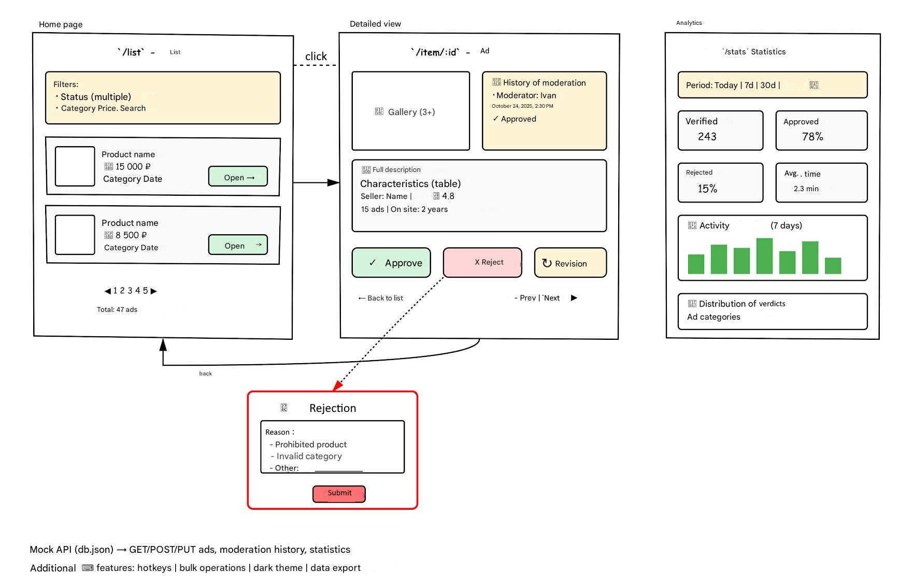

# Internship Test Task for Frontend Intern (Fall 2025 Wave)

## Advertisement Management System for Moderation

### Task Description
Develop a web application for moderating advertisements on the Avito platform. This is a simplified version of the internal system used by moderators to review and manage user ads.

### Business Context
Thousands of ads are published daily on Avito and must go through moderation before publication. Moderators need a convenient tool for quickly reviewing ads, making decisions, and tracking effectiveness.

### Technical Requirements

#### Mandatory
- Node.js v20
- React v18+
- react-router-dom for routing
- Use the provided API located in the `server` folder of this repository
- Source code must contain a README with launch instructions and justification for optional technology choices

#### Optional
- Any UI component library may be used
- TypeScript is desirable
- Any external libraries are allowed, including:
  - Design system/UI kit (Material UI, Ant Design)
  - State management (Redux, MobX, Effector)
  - Linter (ESLint)
  - Prettier
  - Build system (Webpack, Vite)
  - HTTP client library (React Query, Axios)
- Ability to run the project in Docker; ideally server and client via docker-compose
- Cancel/abort requests when navigating between pages
- Unit test coverage
- Code comments and documentation

### Functional Requirements

#### 1. Main Page — Advertisement List (/list)
- Cards show:
  - Product image (placeholders allowed)
  - Title
  - Price
  - Category
  - Creation date
  - Status (under moderation / approved / rejected)
  - Priority indicator (normal / urgent)

Filtering and search:
- Filter by status (multi-select)
- Filter by category
- Filter by price range
- Search by advertisement title
- Reset all filters

Sorting:
- By creation date (newest/oldest)
- By price (ascending/descending)
- By priority

Pagination:
- 10 ads per page
- Page navigation
- Show total ad count

#### 2. Advertisement Detail Page (/item/:id)
When a card is clicked, open the detail page.

Advertisement info:
- Image gallery (at least 3 images)
- Full description
- Product specs as a key-value table
- Seller info:
  - Name
  - Rating
  - Number of advertisements
  - Registration date

Moderation history:
- List of all actions on the ad
- Who reviewed (moderator name)
- When (date/time)
- Decision made
- Comment (if any)

Moderator action panel:
- Approve (green)
- Reject (red)
- Return for revision (yellow)

When rejecting:
- Required field for reason
- Quick reason templates:
  - Prohibited item
  - Incorrect category
  - Invalid description
  - Photo issues
  - Suspicion of fraud
  - Other (with input field)

Navigation:
- Back to list
- Previous / Next advertisement buttons for fast moderation

#### 3. Moderator Statistics Page (/stats)

General statistics:
- Metric cards:
  - Total checked ads (today/week/month)
  - Percent approved
  - Percent rejected
  - Average time to check one ad

Charts:
- Activity by day for the last week (bar chart)
- Decision distribution (approved/rejected/for revision) as a pie chart
- Ads checked by category

### Additional Functional Capabilities (optional, after main scope)

1. Hotkeys:
   - `A` — approve
   - `D` — reject
   - `→` — next ad
   - `←` — previous ad
   - `/` — focus search

2. Bulk operations:
   - Checkboxes to select multiple ads
   - Mass approve/reject
   - Selected ads counter

3. Advanced filtering:
   - Save filter sets
   - Sync filters with URL (shareable link)

4. Dark theme:
   - Theme switcher
   - Persist choice in localStorage

5. Data export:
   - Export statistics to CSV
   - PDF report generation

6. Real-time updates:
   - Auto-update new ads list
   - New ads counter
   - Advertisement status

7. Animations:
   - Smooth page transitions
   - Card appearance animation
   - Loading progress bar

8. Period filter on /stats:
   - Today
   - Last 7 days
   - Last 30 days

### What NOT to Do
- No auth/registration (assume user is authorized)
- No real image uploads
- No integrations with external services
